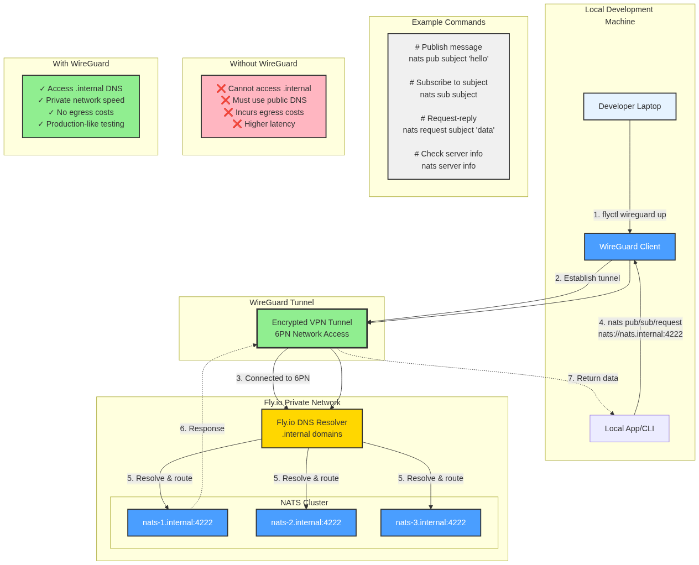

# NATS on Fly.io

## Architecture Overview


See [architecture.mmd](./architecture.mmd) for the full diagram source.

This diagram illustrates how NATS server operates within Fly.io's infrastructure, showing the relationship between NATS cluster nodes, application instances, and DNS resolution patterns.

## Important Notes

### DNS Resolution Strategy

**Use `.internal` DNS for internal communication:**
- **Connection string:** `nats://nats.internal:4222`
- **Why:** Utilizes Fly.io's private 6PN network, providing fast, low-latency connections between apps in the same organization
- **Benefits:** No egress costs, automatic service discovery, secure private networking
- **Best for:** Microservices, event streaming, job queues, real-time data sync within Fly.io

**Use public DNS for external access:**
- **Connection string:** `nats://your-app-name.fly.dev:4222`
- **Why:** Routes through the public internet
- **Trade-offs:** Higher latency, incurs egress charges
- **Best for:** External clients, hybrid cloud setups, local development, third-party integrations

### NATS Cluster Configuration

- NATS servers form a mesh cluster for high availability
- Each server is accessible via individual DNS names (`nats-1.internal`, `nats-2.internal`, etc.)
- Use the service-level DNS (`nats.internal`) for automatic load balancing across cluster nodes
- Cluster communication happens over the private 6PN network

### Security Considerations

- Internal `.internal` DNS is only accessible within your Fly.io organization
- Public endpoints should be secured with authentication (NATS credentials, tokens, or TLS)
- Consider using Fly.io's private networking for all internal app-to-NATS communication

### Performance Tips

- Deploy NATS servers in the same region as your application instances to minimize latency
- Use connection pooling in your applications
- Configure appropriate timeouts and reconnection strategies
- Monitor NATS metrics for throughput and connection health

## Local Development with WireGuard



See [wireguard-flow.mmd](./wireguard-flow.mmd) for the diagram source.

### Why Use WireGuard?

WireGuard allows you to connect your local development machine directly to Fly.io's private 6PN network, enabling you to:

- **Access `.internal` DNS from localhost** - Connect to `nats://nats.internal:4222` as if your machine was running on Fly.io
- **Avoid public endpoints** - No need to expose NATS publicly or incur egress costs during development
- **Test production-like setup** - Use the same connection strings locally as your deployed apps
- **Secure connection** - Encrypted tunnel to your Fly.io organization's private network

### Setting Up WireGuard

1. **Create WireGuard configuration:**
   ```bash
   fly wireguard create
   ```
   This generates a WireGuard config file (e.g., `laptop-asuncion.conf`)

2. **Connect to the tunnel:**
   ```bash
   sudo wg-quick up laptop-asuncion
   ```

3. **Disconnect from the tunnel:**
   ```bash
   sudo wg-quick down laptop-asuncion
   ```

4. **Fix MTU issues (if experiencing connection drops):**
   ```bash
   sudo ip link set dev laptop-asuncion mtu 1280
   ```

### DNS Configuration

**You need to update `/etc/hosts` for internal DNS resolution:**

To access `.internal` domains from your local machine, add an entry to `/etc/hosts` pointing the internal hostname to its IPv6 address:

```
<IPv6_ADDRESS> nats-server-summer-tree-8296.internal
```

**Finding the IPv6 address:**

1. **Verify WireGuard interface:**
   ```bash
   ip addr show laptop-asuncion
   ```

2. **Test connectivity to Fly DNS:**
   ```bash
   ping6 fdaa::3
   ```

3. **Resolve internal hostname:**
   ```bash
   dig @fdaa::3 nats-server-summer-tree-8296.internal AAAA
   ```

4. **Test NATS port accessibility:**
   ```bash
   nc -zv nats-server-summer-tree-8296.internal 4222
   ```

### Connecting from Localhost

Once WireGuard is active and `/etc/hosts` is configured, use the internal connection string:

```bash
# Connect using the internal hostname
nats://nats-server-summer-tree-8296.internal:4222
```

### Verify NATS Installation

1. **Check server information:**
   ```bash
   nats server info -s nats-server-summer-tree-8296.internal:4222
   ```

2. **Test messaging (Pub/Sub):**
   
   Subscribe to a test subject:
   ```bash
   nats sub -s nats-server-summer-tree-8296.internal:4222 test.subject
   ```
   
   Publish a message (in another terminal):
   ```bash
   nats pub -s nats-server-summer-tree-8296.internal:4222 test.subject "Hello NATS"
   ```

3. **Check round-trip time:**
   ```bash
   nats rtt -s nats-server-summer-tree-8296.internal:4222
   ```

**Benefits:**
- No code changes between local and production
- Test with production-like latency and networking
- Access all internal services in your Fly.io organization

## Changelog

### 2026-02-16
- **Cost Optimization**: Released dedicated IPv4 address (169.155.54.47) to save $2/month
  - NATS server now relies solely on Fly.io's private 6PN network for internal communication
  - WireGuard and Fly.io apps continue to access NATS via `.internal` DNS
  - IPv6 public address retained (free) for potential future external access
