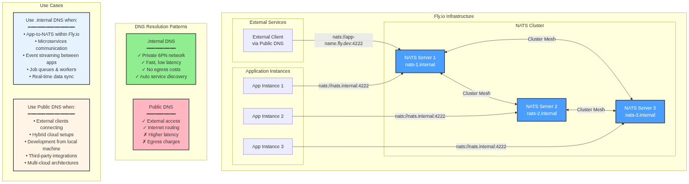

# NATS on Fly.io

## Architecture Overview

See [architecture.mmd](./architecture.mmd) for the full diagram source.

This diagram illustrates how NATS server operates within Fly.io's infrastructure, showing the relationship between NATS cluster nodes, application instances, and DNS resolution patterns.

## Important Notes

### DNS Resolution Strategy

**Use `.internal` DNS for internal communication:**
- **Connection string:** `nats://nats.internal:4222`
- **Why:** Utilizes Fly.io's private 6PN network, providing fast, low-latency connections between apps in the same organization
- **Benefits:** No egress costs, automatic service discovery, secure private networking
- **Best for:** Microservices, event streaming, job queues, real-time data sync within Fly.io

**Use public DNS for external access:**
- **Connection string:** `nats://your-app-name.fly.dev:4222`
- **Why:** Routes through the public internet
- **Trade-offs:** Higher latency, incurs egress charges
- **Best for:** External clients, hybrid cloud setups, local development, third-party integrations

### NATS Cluster Configuration

- NATS servers form a mesh cluster for high availability
- Each server is accessible via individual DNS names (`nats-1.internal`, `nats-2.internal`, etc.)
- Use the service-level DNS (`nats.internal`) for automatic load balancing across cluster nodes
- Cluster communication happens over the private 6PN network

### Security Considerations

- Internal `.internal` DNS is only accessible within your Fly.io organization
- Public endpoints should be secured with authentication (NATS credentials, tokens, or TLS)
- Consider using Fly.io's private networking for all internal app-to-NATS communication

### Performance Tips

- Deploy NATS servers in the same region as your application instances to minimize latency
- Use connection pooling in your applications
- Configure appropriate timeouts and reconnection strategies
- Monitor NATS metrics for throughput and connection health
